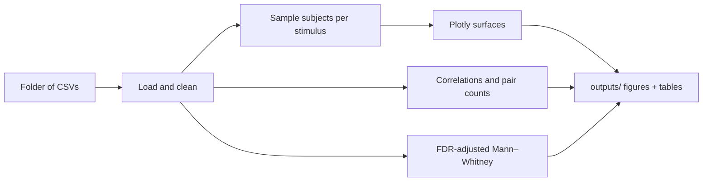

<h1 align="center">EEG Advanced Analytics</h1>

<p align="center">
  <a href="https://github.com/fraware/EEG-Advanced-Analytics/actions/workflows/ci.yml"></a>
  &nbsp;
  <a href="https://www.python.org/downloads/"></a>
  &nbsp;
  <a href="LICENSE"></a>
</p>

<p align="center">
  <em>Reproducible analysis for UCI-style EEG tables — figures, correlations, and rigorous group comparisons, without hard-coded paths.</em>
</p>

---

## Overview

This project is a small, **installable Python package** built for researchers who work with the [UCI EEG database](https://archive.ics.uci.edu/dataset/121/eeg+database) (or CSV exports in the same shape). It contrasts **alcoholic** (`a`) and **control** (`c`) participants using:

- **Interactive and static visuals** (Plotly HTML, matplotlib heatmaps)
- **Trial-level correlation structure** and summaries of strongly coupled channel pairs
- **Mann–Whitney U tests** with **Benjamini–Hochberg FDR** across the full sensor × stimulus grid
- **Rank-biserial effect sizes** alongside raw *p*-values

Everything is written under an output folder you choose, so runs are **headless-friendly** on servers and reproducible on any machine once data paths are configured.

---

## Table of contents

| | |
|:---|:---|
| [Quick start](#quick-start) | Get from clone to first run in a few commands |
| [How it works](#how-it-works) | Pipeline sketch and default analysis choices |
| [Data](#data) | Where to obtain files and what columns are required |
| [Configuration](#configuration) | Resolving the data directory |
| [Installation](#installation) | Virtualenv, extras, `requirements.txt` |
| [Usage](#usage) | CLI, options, and Python API |
| [Outputs](#outputs) | What appears on disk |
| [Package map](#package-map) | Source modules at a glance |
| [Development](#development) | Lint, types, tests, CI |
| [References](#references) | Background literature |

---

## Quick start

```bash
git clone https://github.com/fraware/EEG-Advanced-Analytics.git
cd EEG-Advanced-Analytics

python -m venv .venv
.venv\Scripts\activate          # Windows
# source .venv/bin/activate     # Linux / macOS

pip install -e "."
```

Put your UCI training CSVs in a single folder, then either export `EEG_DATA_DIR` to that folder or pass `--data-dir`:

```bash
set EEG_DATA_DIR=D:\data\SMNI_CMI_TRAIN\Train
eeg-analyze --output-dir outputs
```

On Linux or macOS, use `export EEG_DATA_DIR=/path/to/Train` instead of `set`.

For contributors, use `pip install -e ".[dev]"` so Ruff, Mypy, and pytest are available (see [Development](#development)).

---

## How it works

High-level flow from directory of CSVs to artifacts:



**Defaults worth knowing**

| Topic | Choice in this repo |
|--------|---------------------|
| Stimuli in the loop | `S1 obj`, `S2 match` (override via `run_pipeline(..., stimuli_list=...)`) |
| Correlation threshold for **bar chart** pair counts | `0.9` on per-trial correlation matrices |
| Threshold for **printed** high-correlation pairs after heatmaps | `0.97` |
| Multiple comparisons | One **global** Benjamini–Hochberg step over all sensor × stimulus tests at α = 0.05 |
| Subject sampling | One `a` and one `c` name per stimulus, sorted then indexed; RNG from `numpy.random.Generator` with CLI `--seed` |

---

## Data

The canonical source is the **[UCI EEG Database](https://archive.ics.uci.edu/dataset/121/eeg+database)** — multivariate time series with 64 scalp channels, 256 Hz, alcoholic versus control groups, and several stimulus conditions.

**Getting files ready**

1. Download the dataset and locate the directory that contains the training CSVs (layouts often include a path such as `SMNI_CMI_TRAIN/Train`).
2. Point this tool at that directory; it must contain at least one `*.csv` file.

<details>
<summary><strong>Expected CSV columns</strong> (click to expand)</summary>

Column names must match what the loaders expect:

| Column | Role |
|--------|------|
| `name` | Subject / run identifier |
| `subject identifier` | Group code: `a` (alcoholic) or `c` (control) |
| `matching condition` | Stimulus label (e.g. `S1 obj`) |
| `trial number`, `sample num` | Trial and time sample index |
| `sensor position`, `channel` | Electrode label and channel index |
| `sensor value` | Amplitude or derived measure |

</details>

**Built-in preprocessing**

- Sensor renames: `AF1`→`AF3`, `AF2`→`AF4`, `PO1`→`PO3`, `PO2`→`PO4`
- Dropped positions: `X`, `Y`, `nd`
- Leading `Unnamed:*` columns are removed when present

---

## Configuration

The data directory is resolved in this order:

1. **`--data-dir`** on the CLI  
2. **`EEG_DATA_DIR`** in the environment  
3. **Default:** `data/train` relative to the current working directory  

At startup the pipeline loads a **`.env`** file if present (`python-dotenv`). Keep secrets and machine-specific paths out of git — `.env` is listed in `.gitignore`.

---

## Installation

```bash
pip install -e ".[dev]"   # recommended for development
# or
pip install -e "."       # runtime only
```

| Extra | When to use it |
|--------|----------------|
| **`dev`** | Ruff, Mypy, pytest, pytest-cov, pre-commit, type stubs |
| **`kaleido`** | Static Plotly export via `visualization.optional_write_static` |
| **`mne`** | Optional hook for future MNE-Python workflows (`mne_spike.py`) |

[`requirements.txt`](requirements.txt) lists the same runtime bounds as `pyproject.toml` for workflows that prefer `pip install -r requirements.txt`. Installing the **package** with `pip install -e .` is still recommended so the `eeg-analyze` command and imports resolve correctly.

---

## Usage

**Command line**

```bash
eeg-analyze
eeg-analyze --data-dir "D:\data\Train" --output-dir outputs --interactive
python -m eeg_advanced_analytics --help
```

| Option | Meaning |
|--------|---------|
| `--data-dir` | Folder of EEG CSVs; overrides `EEG_DATA_DIR` |
| `--output-dir` | Root for artifacts (default: `outputs`) |
| `--interactive` | Open Plotly figures in the browser as well as saving HTML |
| `--seed` | RNG seed for subject sampling (default: `RANDOM_SEED` in `constants`) |

**Python**

```python
from pathlib import Path
from eeg_advanced_analytics.pipeline import run_pipeline

run_pipeline(
    data_dir=Path("/path/to/Train"),
    output_dir=Path("outputs"),
    interactive=False,
    seed=123,
)
```

---

## Outputs

All paths are under your chosen output root (default **`outputs/`**).

| Location | What you get |
|----------|----------------|
| `figures/surface_<stimulus>_a.html` · `..._c.html` | 3D surface / heatmap per group |
| `figures/corr_pairs_<stimulus>.html` | Correlated channel pairs, alcoholic vs control |
| `figures/sensor_correlation_heatmap_<stimulus>.png` | Pairwise correlation heatmaps (matplotlib) |
| `figures/significant_differences.html` | FDR-based significance overview by sensor |
| `tables/mann_whitney_fdr.csv` | Full grid: `p_value`, `p_value_fdr_bh`, `rank_biserial`, rejection flags |

The CSV is the authoritative table for reporting: use **`p_value_fdr_bh`** and **`reject_null_fdr`** when interpreting results under the global FDR policy described above.

---

## Package map

| Module | Responsibility |
|--------|----------------|
| [`config.py`](src/eeg_advanced_analytics/config.py) | Path resolution and validation |
| [`constants.py`](src/eeg_advanced_analytics/constants.py) | Seeds, sensor maps, exclusions |
| [`data_loading.py`](src/eeg_advanced_analytics/data_loading.py) | Read and normalize CSVs |
| [`data_processing.py`](src/eeg_advanced_analytics/data_processing.py) | `sample_data` for paired groups |
| [`statistical_analysis.py`](src/eeg_advanced_analytics/statistical_analysis.py) | Correlations, FDR, Mann–Whitney, heatmaps |
| [`visualization.py`](src/eeg_advanced_analytics/visualization.py) | Plotly HTML and helpers |
| [`pipeline.py`](src/eeg_advanced_analytics/pipeline.py) | `run_pipeline` orchestration |
| [`cli.py`](src/eeg_advanced_analytics/cli.py) | `eeg-analyze` entry point |
| [`mne_spike.py`](src/eeg_advanced_analytics/mne_spike.py) | Optional MNE direction |

Tests live in [`tests/`](tests/).

---

## Development

```bash
ruff check src tests && ruff format --check src tests
mypy src
pytest
```

One-time: `pre-commit install` — configuration is in [`.pre-commit-config.yaml`](.pre-commit-config.yaml).

**CI** ([`.github/workflows/ci.yml`](.github/workflows/ci.yml)): on pushes and pull requests to `main`, installs `.[dev]`, runs Ruff (lint + format check), Mypy, and pytest with `MPLBACKEND=Agg`.

---

## References

1. Johnstone, S. J., et al. (2007). Functional brain mapping of psychopathology. *Journal of Clinical Neurophysiology*, 24(3), 275–290.  
2. Davidson, R. J. (2004). Well-being and affective style: Neural substrates and biobehavioral correlates. *Philosophical Transactions of the Royal Society B*, 359(1449), 1395–1411.  
3. Knyazev, G. G. (2007). Motivation, emotion, and their inhibitory control mirrored in brain oscillations. *Neuroscience and Biobehavioral Reviews*, 31(3), 377–395.
